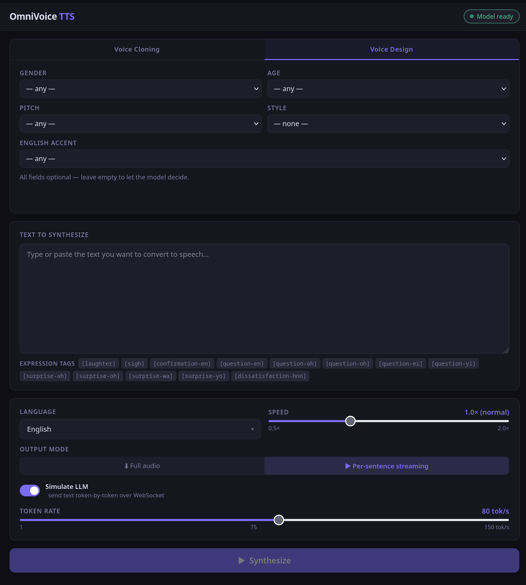

# OmniVoice TTS Server



A self-hosted text-to-speech service built on the [OmniVoice](https://huggingface.co/k2-fsa/OmniVoice) model. Supports multilingual synthesis, voice cloning from a reference audio clip, voice design via natural-language descriptors, real-time per-sentence streaming, and a built-in web UI.

> **AI disclosure** — this project was mostly vibecoded using Claude. The architecture, feature set, and code were developed through an iterative conversation with the model. Treat it accordingly.


## Repository layout

```
.
├── server/          # FastAPI + OmniVoice Python backend
│   ├── main.py
│   └── src/
│       ├── config.py
│       ├── chunker.py     # BlingFire sentence splitter
│       └── inference.py   # Model call + WAV encoding
│   ├── voices/     # Built-in voice samples (.wav + .txt pairs)
│   └── Dockerfile
├── frontend/        # Svelte 5 / TypeScript web UI (Deno 2 + Vite)
│   └── src/
├── scripts/
│   └── test_endpoint.py   # CLI smoke-test for the API
├── docker-compose.yml      # Development stack
├── docker-compose.prod.yml # Production stack (single port)
├── prod.Dockerfile         # Multi-stage build (frontend baked in)
└── .env.example
```

## Prerequisites

- Docker + Docker Compose with the [NVIDIA Container Toolkit](https://docs.nvidia.com/datacenter/cloud-native/container-toolkit/install-guide.html)
- A CUDA-capable GPU

The server downloads model weights from Hugging Face on first run (~several GB). Mount a persistent cache volume (see below) to avoid re-downloading.

## Development

Copy the example env file and adjust as needed:

```bash
cp .env.example .env
```

Start the full stack with live-reload:

```bash
docker compose up --watch
```

- Frontend: http://localhost:5173
- API: http://localhost:9001
- API docs: http://localhost:9001/docs

`--watch` enables file sync — edits to `server/main.py`, `server/src/`, and `frontend/src/` are reflected immediately without a full rebuild.

To persist the model cache between runs:

```bash
HF_HOME=$HOME/.cache/huggingface docker compose up --watch
```

## Production

The production build compiles the frontend and bakes it into the server image, serving everything from a single port:

```bash
docker compose -f docker-compose.prod.yml up -d
```

- UI + API: http://localhost:9001

## Environment variables

| Variable | Default | Description |
|---|---|---|
| `DEVICE_MAP` | `cuda:0` | CUDA device for inference, e.g. `cuda:0` |
| `VOICE_SAMPLES_DIR` | `/app/voices` | Path to built-in voice samples inside the container |
| `STATIC_DIR` | _(unset)_ | Path to compiled frontend static files (set automatically in prod) |
| `HF_HOME` | `./server/models` | Host path for the Hugging Face model cache |
| `HF_TOKEN` | _(unset)_ | Hugging Face token for gated models |
| `LOGFIRE_TOKEN` | _(unset)_ | [Logfire](https://logfire.pydantic.dev) token; telemetry is disabled when absent |

## Web UI

### Voice Cloning tab

Clone a speaker's voice from a short audio reference:

- **Built-in voices** — pick from voice samples in `server/voices/`; the first available voice is pre-selected
- **Custom audio** — upload your own clip (WAV, MP3, FLAC, OGG, M4A) with a matching transcript; optionally save it as a named built-in voice
- Built-in voice list scrolls when there are many entries; the card stays a consistent height regardless of which tab is active

### Voice Design tab

Describe a voice instead of cloning one. Combine any of:

- Gender (male / female)
- Age (child → elderly)
- Pitch (very low → very high)
- Style (whisper)
- English accent (American, British, Australian, Canadian, Indian, Korean, Japanese, Portuguese, Russian)

The descriptor string is previewed live and passed to the model as an `instruct` parameter — no reference audio is required.

### Output modes

| Mode | Behaviour |
|---|---|
| **Full audio** | The entire text is synthesised in one model call; audio downloads before playback begins |
| **Per-sentence streaming** | Text is split into sentences by [BlingFire](https://github.com/microsoft/BlingFire); each sentence is synthesised and played back as soon as it is ready via the Web Audio API, with gapless scheduling |
| **Simulate LLM** _(streaming only)_ | The input text is tokenised with GPT-4's `cl100k_base` tokeniser and sent token-by-token over a WebSocket, simulating real LLM output. A slider controls the token rate (1–150 tok/s). The text area shows already-sent tokens in a dimmed colour as they stream |

### Playback controls

- A **Stop** button appears during synthesis; it aborts the in-flight HTTP request or WebSocket and silences any buffered audio
- A separate **Stop playback** button appears after synthesis completes while streamed audio is still playing back
- Latency stats are shown below the result: **First chunk** time (streaming modes) and **Total** time from submit to last audio chunk / full response

### Other controls

- **Language** — ISO 639-3 code or full language name
- **Speed** — 0.5× – 2.0× slider
- **Download** — saves the combined WAV of the entire session

## Adding built-in voices

Place a `.wav` file (or `.mp3`, `.flac`, `.ogg`, `.m4a`) in `server/voices/`. Optionally add a `.txt` file with the same stem containing the transcript of the recording — this improves cloning quality and is displayed in the UI.

```
server/voices/
  alice.wav
  alice.txt    # "Hi, this is Alice speaking."
```

The voice ID is the filename stem (`alice`). Voices appear in the UI and via `GET /v1/voices` immediately without a restart.

You can also upload and permanently save a custom voice directly from the UI by filling in the "Save as voice" field.

## API

| Method | Path | Description |
|---|---|---|
| `POST` | `/v1/synthesize` | Synthesize speech (see parameters below) |
| `WS` | `/v1/ws/synthesize` | Streaming WebSocket synthesis (token-by-token input) |
| `GET` | `/v1/languages` | List supported languages |
| `GET` | `/v1/voices` | List built-in voices |
| `GET` | `/v1/voices/{id}/preview` | Stream the reference audio for a voice |
| `DELETE` | `/v1/voices/{id}` | Delete a built-in voice |
| `GET` | `/health` | `{"status": "ok", "model_loaded": true/false}` |

Full interactive docs at `/docs` when the server is running.

### `POST /v1/synthesize` parameters

All fields are `multipart/form-data`.

| Field | Type | Description |
|---|---|---|
| `text` | string | Text to synthesise |
| `language` | string | ISO 639-3 code or full name (default: `en`) |
| `speed` | float | Playback speed multiplier (default: `1.0`) |
| `stream` | bool | Enable per-sentence streaming response (default: `false`) |
| `voice_id` | string | ID of a built-in voice sample |
| `ref_audio` | file | Custom reference audio clip |
| `ref_text` | string | Transcript of `ref_audio` (required when `ref_audio` is set) |
| `ref_voice_name` | string | If set, saves `ref_audio` as a new built-in voice under this name |
| `instruct` | string | Voice design descriptor (mutually exclusive with `ref_audio` / `voice_id`) |

Either `voice_id`, `ref_audio` + `ref_text`, or `instruct` must be provided.

When `stream=true` the response is `application/octet-stream` with length-prefixed binary frames: each frame is a 4-byte big-endian uint32 length followed by that many bytes of WAV data.

### `WS /v1/ws/synthesize` parameters

Passed as query parameters. Send text fragments as UTF-8 text messages; send an empty string `""` to signal end-of-input. The server replies with raw WAV binary messages as each sentence is synthesised.

| Parameter | Description |
|---|---|
| `language` | ISO 639-3 code or full name |
| `voice_id` | ID of a built-in voice sample |
| `speed` | Speed multiplier |
| `instruct` | Voice design descriptor (alternative to `voice_id`) |

### Quick examples

```bash
# Full audio, built-in voice
curl -X POST http://localhost:9001/v1/synthesize \
  -F "text=Hello, world!" \
  -F "language=en" \
  -F "voice_id=alice" \
  --output output.wav

# Voice design
curl -X POST http://localhost:9001/v1/synthesize \
  -F "text=Hello, world!" \
  -F "language=en" \
  -F "instruct=female, young adult, british accent" \
  --output output.wav
```

## Testing

```bash
python scripts/test_endpoint.py \
  --ref-audio server/voices/alice.wav \
  --ref-text "Hi, this is Alice speaking." \
  --text "The quick brown fox jumps over the lazy dog." \
  --output out.wav
```
